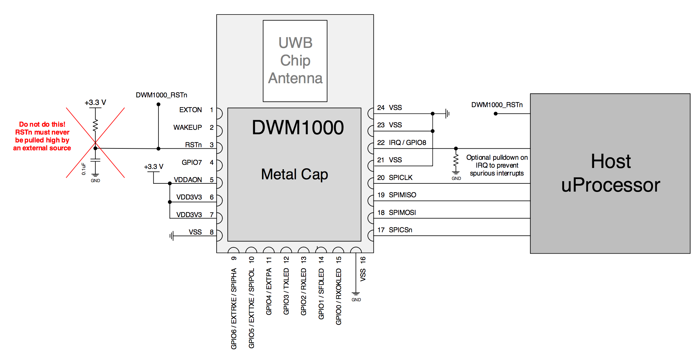

# tagArduino

### Prerequisite

- Arduino IDE
- Navigate [arduino-dw1000](https://github.com/thotro/arduino-dw1000) and follow
instruction to install the library
- [DWM1000 breakout boards](https://oshpark.com/shared_projects?q=dwm1000)

## Installation

### Flashing

1. Copy `debug.h`, `def.h`, `dwm1000.h`, and `i2c.h` from `headers` directory to here
1. Edit a sketch file `tagArduino.ino`
   - Edit `networkId` to have a specific integer so that all anchors and tags
      share the same value
   - Edit `tagId` to have a unique integer. **DO NOT REMOVE `FLAG_TAG |`**
   - Edit `I2CSLAVEADDR` in `i2c.h` to have the same value that `tagRPi` has
1. Flash the sketch file

### Wiring

Wire 3.3 V and ground as shown in below:

Figure from [DWM1000 datasheet](https://www.decawave.com/sites/default/files/resources/dwm1000-datasheet-v1.3.pdf)

- `IRQ`: `PIN_IRQ` in the sketch
   - Default: Arduino Pro Mini pin labeled 2
- `RSTn`: `PIN_RST` in the sketch
   - Default: Arduino Pro Mini pin labeled 9
- `SPICSn`: `PIN_SS` in the sketch
   - Default: Arduino Pro Mini pin labeled 10 (`SS`)
- `SPIMOSI`: Arduino Pro Mini pin labeled 11 (`MOSI`)
- `SPIMISO`: Arduino Pro Mini pin labeled 12 (`MISO`)
- `SPICLK`: Arduino Pro Mini pin labeled 13 (`CLK`)

## State Diagram

## Installing `tagArduino`

- Copy or link `def.h`, `dwm1000.h`, `i2c.h` from the parent directory to here
- Edit `I2CSLAVEADDR` in `i2c.h` if needed

Compile and upload via Arduino IDE
